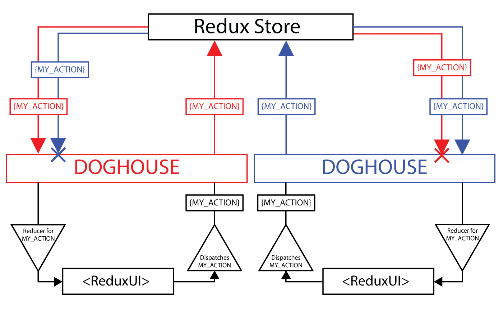

# redux-doghouse

`redux-doghouse` is a library that aims to make **reusable components** easier to build with Redux by **scoping actions and reducers** to a particular instance of a component.



It includes tools to help you build **Scoped Actions** and **Scoped Reducers** with minimal modifications to your code. That way, if you build a Redux store for a `Parent` with an **arbitrary number** of `Children` (meaning there can be none, one, or a million of them), actions affecting `Child A` won't affect `Child B` through `Child Z`.

**You can read more about why we built `redux-doghouse`, and our real-world use-case, in this [blog post](http://engineering.datadoghq.com/redux-doghouse--creating-reusable-react-redux-components-through-scoping/).**

# Getting Started
## Installation
```
npm install redux-doghouse
```

## Running Examples
### Counters ([Live Demo](https://redux-doghouse-example.now.sh/))
An app that renders an arbitrary number of `<Counter>`s, with the ability to change the value of one of them at a time, all of them at once, or only the ones with even or odd numbers
```
npm run counters
```

# API
1. [scopeActionCreators](#scopeactioncreatorsactioncreators-scopeID)
2. [ScopedActionFactory](#scopedactionfactoryactioncreators)
3. [bindScopedActionFactories](#bindscopedactionfactoriesactionfactories-dispatch-bindfn)
4. [bindActionCreatorsDeep](#bindactioncreatorsdeepactioncreatortree-dispatch)
5. [scopeReducers](#scopereducersreducers)

## For Actions
### `scopeActionCreators(actionCreators, scopeID)`
Adds a scope to the output of a set of action creators

The `actionCreators` should be in the same format that you would pass to `bindActionCreators`. e.g:
```javascript
(value) => ({type: SET_FOO, value})
```
or
```javascript
{
    foo: (value) => ({type: SET_FOO, value})
}
```
It will then **scope** each of these action creators, so that the resulting action will include the `scopeID`.
```javascript
{
    foo: (value) => ({
        type: SET_FOO, value,
        scopeID: "[the specified scopeID]"
    })
}
```

#### Arguments
 - `actionCreators` *(Function or Object)*: An action creator, or an object whose values are action creators. The values can also be nested objects whose values are action creators (or more nested objects, and so on).
- `scopeID` *(String or Number)*: An identifier to include in any actions created by the `actionCreators`

#### Returns

*(Object or Function)*: An object mimicking the original object, but with each function adding `{ scopeID }` to the *Object* that they return. If you passed a function as `actionCreators`, the return value will also be a single function.

#### Example
```javascript
import { scopeActionCreators } from 'redux-doghouse';
import { actionCreators } from './my-actions';

// Before scoping:
actionCreators.foo('bar');
// Will return
{
    type: 'SET_FOO',
    value: 'bar'
};
/// After scoping:
scopeActionCreators(actionCreators, 'a').foo('bar')
// Will return
{
    type: 'SET_FOO',
    value: 'bar',
    scopeID: 'a'
}
```

### `ScopedActionFactory(actionCreators)`
Works similarly to `scopeActionCreators`, but with the added benefit of `instanceof` checking. This allows you to write a check to see whether or not a set of action creators is an `instanceof ScopedActionFactory`.

For example, the included `bindActionCreatorsDeep` function will intelligently bind an object tree of both scoped and un-scoped action creators, depending on whether it's passed plain objects or `ScopedActionFactory` instances.

#### Arguments
- `actionCreators` *(Function or Object)*: An action creator, or an object whose values are action creators

#### Returns

*(ScopedActionFactory)* A class of object with the following:

##### Instance Methods
###### `scope(id): Object`
Runs `scopeActionCreators(id)` on the `actionCreators` that were passed to the `new ScopeActionFactory`, and returns the result.

#### Example
```javascript
import { ScopedActionFactory } from 'redux-doghouse';
import { actionCreators } from './my-actions';

const scopeableActions = new ScopedActionFactory(actionCreators);
const actionCreatorsScopedToA = scopeableActions.scope('a');
const actionCreatorsScopedToB = scopeableActions.scope('b');

actionCreatorsScopedToA.foo('bar')
// Will return
{
    type: SET_FOO,
    value: 'bar',
    scopeID: 'a'
}
```

### `bindScopedActionFactories(actionFactories, dispatch, [bindFn])`
Takes an object of `actionFactories` and binds them all to a `dispatch` function. By default, it will use Redux's included `bindActionCreators` to do this, but you can specify a `bindFn` to use instead.

#### Arguments
- `actionFactories` *(Object or ScopedActionFactory)*: A single ScopedActionFactory, or an object whose values are ScopedActionFactories.
- `dispatch` *(Function)*: A function to which the resulting action creators from `actionFactories` should be dispatched; usually this is the `dispatch` method of a Redux store
- [`bindFn`] *(Function)*: If specified, this function will be used to bind resulting action creators to the `dispatch`. If unspecified, Redux's native `bindActionCreators` will be used by default.

#### Returns
*(Object or ScopedActionFactory)*: An object mimicking the original object, but with each `ScopedActionFactory` generating functions that will immediately dispatch the action returned by the corresponding action creator. If you passed a single factory as `actionFactories`, the return value will also be a single factory.

#### Example
```javascript
import { createStore } from 'redux';
import { ScopedActionFactory, bindScopedActionFactories } from 'redux-doghouse';
import { actionCreators, reducers } from './my-redux-component';

const store = createStore(reducers);
const scopeableActions = {
    myComponentActions: new ScopedActionFactory(actionCreators);
}
const boundScopeableActions = bindScopedActionFactories(scopeableActions, store.dispatch);
```

### `bindActionCreatorsDeep(actionCreatorTree, dispatch)`
Extends Redux's native `bindActionCreators` to allow you to bind a whole tree of nested action creator `function`s and `ScopedActionFactory` instances to a `dispatch` function.

#### Arguments
- `actionCreatorTree` *(Object)*: An object whose values can be:
    - A *Function* to be bound to the `dispatch`
    - A `ScopedActionFactory` to be bound to the `dispatch`
    - Another *Object* containing either of these (or more nested *Object*)
- `dispatch` *(Function)*: A function to which the members of `actionCreatorTree` should be dispatched; usually this is the `dispatch` method of a Redux store

#### Example
```javascript
import { bindActionCreatorsDeep, ScopedActionFactory } from 'redux-doghouse';
import { createStore } from 'redux';
import { reducers } from './my-reducers';

const store = createStore(reducers);

const actionCreators = {
    fooActions: {
        bar: (value) => ({type: 'BAR', value})
    },
    barActions: {
        baz: new ScopedActionFactory({
            quux: (value) => ({type: 'QUUX'})
        })
    }
}
const boundActionCreators = bindActionCreatorsDeep(boundActionCreators, store.dispatch);
```

## For Reducers

### `scopeReducers(reducers)`
This acts as an extension of Redux's `combineReducers`, which takes an object of `reducers` in the form of `{ [prop]: reducer(state, action) }` pairs and combines them into a single reducer that returns `{ [prop]: state }` pairs. `scopeReducers` goes a step further and returns an object of `{ [scopeID]: { [prop]: state} }` pairs.

In other words, it will create a reference to your `reducers` for each new `scopeID` you add to your data model, and route scoped actions to their corresponding `scopeID` when reducing a new state.

#### Arguments
- `reducers` *(Object)*: An object whose keys correspond to property names, and whose values correspond to different reducing functions that need to be combined into one and reused across multiple scopes.

#### Returns
*(Function)*: A reducer that takes an object of state objects in the form of `{ [scopeID]: state }` pairs, and an action that includes a `scopeID`. The reducer will return a new object mimicking the original object, but for each key:

1. For the matching `scopeID`, invoke the `reducers` to construct a new state object with the same shape as the `reducers`
2. Leave all the other `scopeID`s' state objects unchanged

#### Example
```javascript
// Given these actionCreators...
import { scopeActionCreators } from 'redux-doghouse';
const reducers = {
    foo: (state = 0, action) => {
        switch (action.type) {
            case 'INCREMENT_FOO':
                return state + 1;
            case 'DECREMENT_FOO':
                return state - 1;
            default:
                return state;
        }
    }
};
const actionCreatorsA = scopeActionCreators({
    incrementFoo: () => ({type: 'INCREMENT_FOO'})
}, 'a');

// Without scoping
import { combineReducers } from 'redux';
const combinedReducers = combineReducers(reducers);
const state = {foo: 0};
combinedReducers(state, actionCreatorsA.incrementFoo());
// Will return
{foo: 1}

// With scoping
import { scopeReducers } from 'redux-doghouse';
const scopedReducers = scopeReducers(reducers);
const state = {
    a: {foo: 0},
    b: {foo: 2}
};
scopedReducers(state, actionCreatorsA.incrementFoo());
// Will return
{
    a: {foo: 1},
    b: {foo: 2}
}
```
